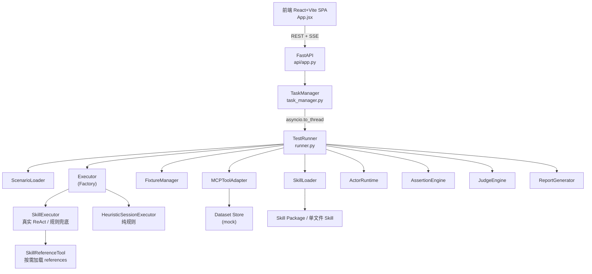
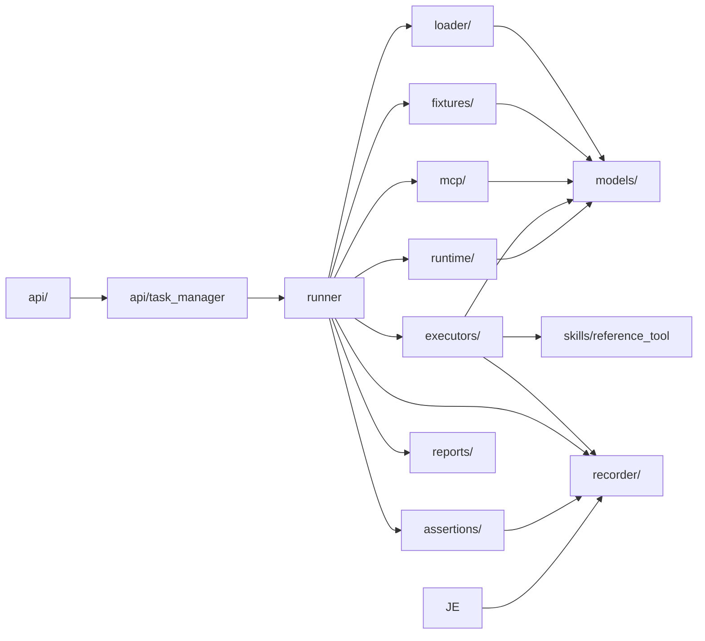
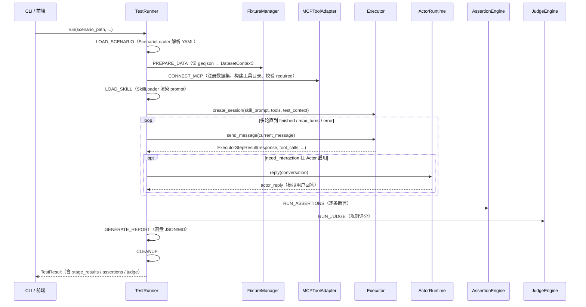
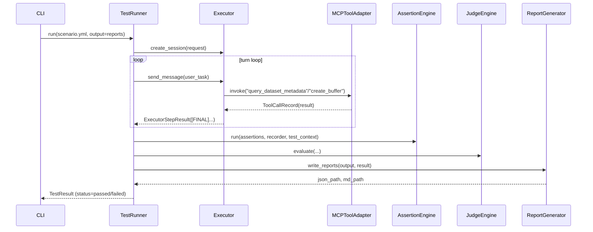
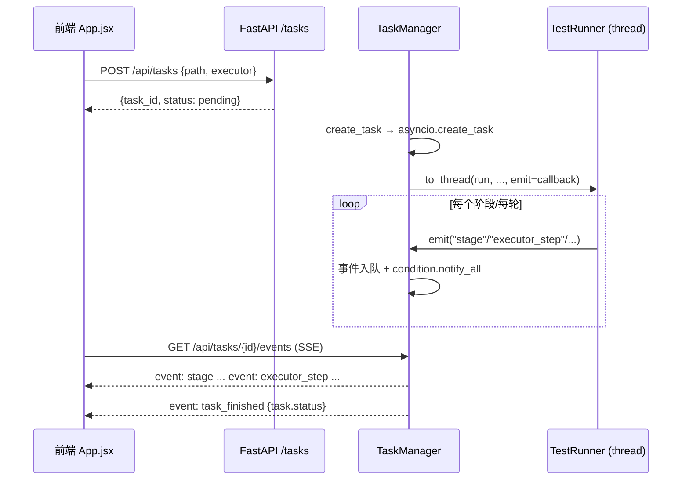

# geo-skill-bench 项目概览

> 本文档由 project-overview-generator 自动生成。基于对 `geoskillbench/`、`frontend/`、`scenarios/`、`skills/`、`docs/` 等目录的分模块阅读整理，面向希望快速上手本项目的新开发者。
>
> **滞后声明（2026-08-24）**：本文生成于早期 MVP 阶段（约"LangGraph runtime path"提交时点）。此后项目经历了阶段一/二改造、迭代 1~4（orchestrator、LLM Judge、模拟用户多轮、云端 MCP 真客户端）等大量演进，文中"项目状态 / 最近 commit / runtime 结构"等描述已过时，以代码与 `../design/` 为准；本文保留作快速入门的架构讲解材料。

---

## 一、项目是什么

### 一句话定位
**geo-skill-bench** 是一个用于自动测试和评估 **GIS Agent Skill** 是否有效的 Python 测试平台（当前为 MVP）。

### 核心价值
- **把"技能好不好用"变成可量化结果**：通过 Scenario（测试场景）声明任务、工具、断言和评分标准，自动跑通"加载技能 → 驱动智能体调用工具 → 断言校验 → AI 评分 → 出报告"全流程。
- **规则优先、Judge 辅助**：能用程序判定的（调了哪个工具、参数对不对、结果数据集存不存在）交给 Assertion Engine 做确定性校验；语义质量（是否理解任务、是否遗漏关键步骤）交给 Judge 评分。
- **Skill 可插拔、Executor 可插拔**：既能测单文件 Skill（YAML 提示词），也能测带 `references/` 的 Skill Package（按需加载参考文档）；被测智能体底层支持 LangGraph 真实 LLM 执行器，或纯规则的启发式执行器（无 LLM 也能跑通全链路）。

### 适用场景 / 使用人群
- GIS 业务团队：验证自己写的 Agent Skill 提示词包是否能稳定驱动 MCP 工具链完成缓冲区分析、裁剪统计等业务。
- 智能体开发/评测人员：把 `geo-skill-bench` 当"智能体/Skill 评测平台"用，回归测试不同 Skill 版本、不同底层模型的稳定性。
- 学习者：通过 `scenarios/` 里的 YAML 读懂"测试场景如何声明预期"，通过 `docs/` 读懂完整设计思路。

### 项目状态
- 版本：`0.1.0`（`pyproject.toml`）
- 活跃度：初始导入 + 两次迭代（最近一次 commit 为 "Add LangGraph executor runtime path"），处于早期 MVP 阶段
- 许可证：无 LICENSE 文件
- 设计基线：`docs/design/00-系统总体设计.md`（含前端控制台 + 后端测试引擎完整设计，当前代码实现了其中 MVP 闭环）

---

## 二、快速开始（Quick Start）

### 前置要求
- Python ≥ 3.11
- Node.js（前端用，若只跑 CLI 可跳过）
- 真实 LLM 需要 OpenAI-compatible 端点（如 GPUStack / vLLM / DashScope），不配也能跑（走规则兜底）

### 安装与运行

```bash
# 1. 克隆代码
git clone <repo-url>
cd geo-skill-bench

# 2. 后端：创建虚拟环境并安装
python3 -m venv .venv
source .venv/bin/activate        # Windows: .venv\Scripts\activate
pip install -e .

# 3. 启动后端（FastAPI，默认 8000 端口）
./scripts/start_backend.sh

# 4.（可选）启动前端（React+Vite，默认 5173 端口）
./scripts/start_frontend.sh
# 或一条命令同时起前后端
./scripts/start_all.sh
```

### 验证运行

```bash
# 后端健康检查
curl http://127.0.0.1:8000/health
# → {"status": "ok"}

# 最直接的验证：用 CLI 跑一个示例场景
python -m geoskillbench.cli validate scenarios/buffer_school_500m_001.yml
python -m geoskillbench.cli run scenarios/buffer_school_500m_001.yml --output reports
# 成功后 reports/json/ 和 reports/markdown/ 下生成对应报告
```

前端打开 `http://127.0.0.1:5173`，选场景 → Create Task → 实时看 SSE 进度。

### 常见启动问题
- `models.yaml` 不存在时真实 LLM 不可用：创建 `models.yaml`（参考根目录 `models.yaml.example`），配置模型别名后，在 scenario 的 `runtime.agent_model` 指向别名。
- 后端端口被占：改 `scripts/start_backend.sh` 里的 `--port`。
- 前端连不上后端：前端默认连 `http://127.0.0.1:8000`，可用 `VITE_API_BASE` 覆盖（见 README）。

---

## 三、核心概念（Core Concepts）

> 理解这些概念后再读代码，会事半功倍。本项目的概念分层：**Scenario 控制测试、Skill 控制思路、MCP Tool 执行动作、Actor 模拟交互、Assertion 校验事实、Judge 评价质量、Report 沉淀结果**。

### 1. Scenario（测试场景）
- **是什么**：一个 YAML 文件，完整声明一次测试的环境与预期：用哪些测试数据、要哪些 MCP 工具、测哪个 Skill、用户任务是什么、断言规则、评分标准。
- **为什么重要**：整个测试流程的"唯一入口"，`runner.py` 的一切都围绕一个 Scenario 展开。
- **涉及代码**：`geoskillbench/models/scenario.py`（Pydantic 模型）、`geoskillbench/loader/scenario_loader.py`、`scenarios/*.yml`（实际用例）。

### 2. Agent Skill（被测技能）
- **是什么**：指导智能体完成某类 GIS 任务的提示词能力包，不直接执行操作，只描述"何时用、需要什么输入、推荐调哪些工具、调用顺序、常见错误、最终输出什么"。支持两种形态：
  - **单文件 Skill**（`*.skill.yml`）：`loader/skill_loader.py` 渲染后整段注入 prompt。
  - **Skill Package**（`SKILL.md` + `references/` + `skill.metadata.json`）：只注入入口 + reference 索引，具体参考文档通过内部工具 `load_skill_reference` **按需加载**。
- **为什么重要**：这是被测对象本身，本平台存在的意义就是检验它。
- **涉及代码**：`geoskillbench/models/skill.py`、`geoskillbench/loader/skill_loader.py`、`skills/`、`geoskillbench/skills/reference_tool.py`。

### 3. MCP Tool（底层能力）
- **是什么**：真正执行 GIS 操作的工具（查元数据、建缓冲区、重投影、发布地图等）。
- **为什么重要**：当前版本 `mcp/mcp_tool_adapter.py` 是**内置 mock 实现**（没有真实几何运算），作用是为整条测试链路提供可运行的工具层。
- **涉及代码**：`geoskillbench/mcp/mcp_tool_adapter.py`。

### 4. Executor（被测智能体执行器）
- **是什么**：实际运行"被测 Agent"的容器。输入用户任务 + Skill prompt + 工具集，输出对话、工具调用记录、最终回答。
- **为什么重要**：它是"被测对象"与"测试框架"之间的唯一边界，`Executor` 抽象接口只有三个方法，下游断言/Judge/报告完全不关心 SUT 怎么跑出来的。
- **涉及代码**：`geoskillbench/executors/base.py`、`skill_executor.py`、`heuristic_executor.py`、`nanobot_executor.py`、`factory.py`。

### 5. Assertion（断言）
- **是什么**：确定性规则校验，一条断言 = 一条"必须成立的说法"，跑完逐条核对给出 passed/failed。
- **为什么重要**：evaluation 平台的灵魂，能写死的规则优先用断言，不交给 LLM 猜。
- **涉及代码**：`geoskillbench/assertions/assertion_engine.py`（12 种断言）。

### 6. Judge（评分者）
- **是什么**：对最终回答做语义质量评估，输出 0~1 分 + issues + suggestions。
- **为什么重要**：当前实现是规则式（基于断言得分减分），不是 LLM 语义评估——这是 MVP 折中，改造计划已关注。
- **涉及代码**：`geoskillbench/runtime/judge_runtime.py`。

### 7. TestResult / Report
- **是什么**：一次测试的结构化结果（Pydantic `TestResult`），落盘为 JSON + Markdown 报告。
- **为什么重要**：是"历史查询 / 回归对比 / 聚合统计"的基础数据载体。
- **涉及代码**：`geoskillbench/models/result.py`、`geoskillbench/reports/report_generator.py`。

---

## 四、技术栈（Tech Stack）

| 分类 | 选型 | 说明 |
|------|------|------|
| 后端语言 | Python ≥ 3.11 | `pyproject.toml` 声明 |
| Web 框架 | FastAPI ≥ 0.115 + uvicorn | `geoskillbench/api/app.py` |
| 数据模型 | Pydantic ≥ 2.7 | 全项目模型校验 |
| 配置解析 | PyYAML ≥ 6.0.1 | Scenario / Skill / models.yaml |
| Agent 编排 | langchain ≥ 0.3 + langgraph ≥ 0.2.50 + langchain-openai | 真实路径用 `create_react_agent` |
| MCP 接入 | 自定义 mock 适配层 | 未用 langchain-mcp-adapters（延后） |
| 前端 | React 18 + Vite 5 | 纯 JSX（未用 TypeScript） |
| 前端实时 | SSE（EventSource） | `task_manager.py` 推送事件流 |
| 前端状态 | 原生 useState | 未用状态库/组件库/图表库 |
| 数据库 | 无 | TaskManager 内存态，重启丢历史 |
| 任务调度 | asyncio + `asyncio.to_thread` | 无任务队列 / 无取消接口 |
| GIS 计算 | mock（无 geopandas/shapely） | 设计文档建议，MVP 未引入 |
| 测试 | 无 pytest 配置 | 尚无自动化测试用例 |

---

## 五、系统架构（Architecture）

### 整体架构图



### 模块依赖图



### 核心数据流 / 主流程



---

## 六、目录结构（Directory Layout）

### 顶层目录

```
geo-skill-bench/
├── geoskillbench/           # 后端主包
│   ├── api/                 # FastAPI 路由 + 任务管理器（SSE）
│   ├── assertions/          # 断言引擎（12 种断言）
│   ├── executors/           # 可插拔执行器（LangGraph/Heuristic/Nanobot + Factory）
│   ├── fixtures/            # 测试数据准备（读 geojson 元信息）
│   ├── loader/              # Scenario / Skill 加载器（含 Skill Package + zip 安全解压）
│   ├── mcp/                 # MCP 工具适配层（mock 实现 + dataset store）
│   ├── models/              # Pydantic 数据模型（scenario/skill/result/test_context）
│   ├── recorder/            # 执行记录（对话/工具调用/reference 加载）
│   ├── reports/             # 报告生成（JSON + Markdown）
│   ├── runtime/             # ActorRuntime / JudgeEngine / llm.py（注：agent_runtime.py 为遗留死代码）
│   ├── skills/              # SkillReferenceTool（按需加载 reference，路径安全）
│   ├── cli.py               # 命令行入口（run / validate / list-tools）
│   └── runner.py            # TestRunner：9 阶段编排（核心）
├── frontend/                # React 前端（App.jsx 单页控制台）
├── scenarios/               # 测试场景 YAML（buffer_school_500m_001 / vector_buffer_school_package_001）
├── skills/                  # Agent Skill 定义（单文件 + Skill Package）
├── fixtures/                # 测试数据（schools.geojson）
├── reports/                 # 输出报告（json/ + markdown/）
├── docs/                    # 设计文档（v0.3 主文档 + 两份补充设计 + 改造计划）
├── scripts/                 # 启动脚本（start_all/start_backend/start_frontend）
├── pyproject.toml           # 包定义 + 依赖 + CLI 入口
├── models.yaml.example      # 模型别名配置示例
└── README.md
```

### 设计约定
- **Executor 接口三段式**：`create_session` / `send_message` / `close_session`，所有执行器统一实现，下游不关心具体实现。
- **会话式多轮由 Runner 控制**：Actor 插在 runner 的 turn loop 里，而不是让执行器内部自循环，保证每轮可记录、可打断。
- **skill 记录与断言分离**：执行器只负责调用 `load_skill_reference`，由 recorder 记录、assertion engine 判定。
- **test_context 携带 `_recorder` 私有字段**：通过 `model_dump()` 后塞入 dict 传给执行器（实现上的 hack，改造时需注意）。
- **`[NEED_INTERACTION]` / `[FINAL]` 协议**：执行器需要用户补充信息时回复以 `[NEED_INTERACTION]` 开头，完成任务时以 `[FINAL]` 开头——runner 据此判断 `need_interaction` 与 `finished`。

---

## 七、核心模块详解（Core Modules）

### 1. `geoskillbench/runner.py` — TestRunner（9 阶段编排核心）

**职责**：
- 编排完整测试流程：LOAD_SCENARIO → PREPARE_DATA → CONNECT_MCP → LOAD_SKILL → RUN_AGENT → RUN_ASSERTIONS → RUN_JUDGE → GENERATE_REPORT → CLEANUP。
- 每一阶段状态（PENDING/RUNNING/PASSED/FAILED）通过 `event_callback` 实时外抛，供 TaskManager 转成 SSE 推给前端。
- 出错时定位"当前 RUNNING 的阶段"标记 FAILED，仍会走 CLEANUP 并产出 `TestResult`。

**文件清单**：

| 文件 | 职责 |
|------|------|
| `runner.py` | 编排、阶段状态机、TestResult 组装 |

**核心函数**：

#### `TestRunner.run(scenario_path, output_dir=None, event_callback=None, run_config=None) -> TestResult`
- **位置**：`geoskillbench/runner.py:65`
- **职责**：一次完整测试的入口，返回结构化 `TestResult`（`models/result.py`）。
- **调用关系**：被 `cli.py`、`api/app.py`、`task_manager.py` 调用；内部调用所有 loader/executor/engine。

**关键逻辑**（RUN_AGENT 阶段的 turn loop，`runner.py:179-219` 主线）：

```python
for turn_index in range(turn_limit):
    step_result = executor.send_message(session.session_id, current_message)
    tool_calls.extend(step_result.tool_calls)
    final_response = step_result.response or final_response
    conversation.append({"role": "assistant", "content": step_result.response})
    emit("executor_step", ..., turn_index=turn_index, ...)

    if step_result.error_message:
        run_failed = True
        recorder.record_error(step_result.error_message)
        break
    if step_result.finished:
        break
    # 需要用户补充信息 → Actor 代答，继续下一轮
    if step_result.need_interaction and scenario.actor.enabled and turn_index < scenario.actor.max_turns:
        actor_reply = self.actor_runtime.reply(scenario, conversation, test_context)
        conversation.append({"role": "user", "content": actor_reply})
        current_message = actor_reply
        continue
    break
```

**说明 / 注意事项**：
- 阶段名常量在 `STAGES`（`runner.py:21`）。
- 最终状态 = `assertion_result.passed and judge_result.passed` → `"passed"`，否则 `"failed"`。
- `run_config` 可覆盖 scenario 里的 `executor` 与 `memory_enabled`。

---

### 2. `geoskillbench/executors/` — 可插拔执行器

**职责**：
- 定义统一 `Executor` 抽象（`base.py`）。
- 提供三种实现：`SkillExecutor`（真实 ReAct / 规则兜底双路径）、`HeuristicSessionExecutor`（纯规则，无 LLM）、`NanobotExecutor`（占位壳，fallback 到规则）。
- `factory.py` 按名字生产执行器。

**文件清单**：

| 文件 | 职责 |
|------|------|
| `base.py` | `Executor` 抽象基类（3 个抽象方法） |
| `factory.py` | `ExecutorFactory.create(name, adapter)` |
| `skill_executor.py` | 真实路径 `create_react_agent` + 兼容路径 fallback 判断 |
| `heuristic_executor.py` | 规则执行：正则推断数据集/距离 → 固定工具链 |
| `nanobot_executor.py` | nanobot 占位，缺包时带 note fallback |

**核心函数**：

#### `SkillExecutor.create_session(request: ExecutorSessionRequest) -> ExecutorSession`
- **位置**：`geoskillbench/executors/skill_executor.py:46`
- **职责**：决定走"真实 LLM 路径"还是"规则兜底路径"，建会话。

**关键逻辑**（`skill_executor.py:46-104` 主线）：

```python
def create_session(self, request):
    model_name = request.role_model_config.get("model", "")
    fallback_reason = self._fallback_reason(model_name)
    if fallback_reason:
        # 走规则兜底（缺依赖 / 没配模型 / 模型名以 rule-based 开头）
        self.compatibility_note = fallback_reason
        fallback_session = super().create_session(request)  # HeuristicSessionExecutor
        fallback_session.runtime_mode = "compatibility"
        return fallback_session
    # 真实路径：现场搭 LangGraph ReAct Agent
    llm = build_llm(model_name, temperature=0.0, config=self.models_config)
    tools = self._build_langgraph_tools(state)
    agent = create_react_agent(llm, tools=tools,
                               prompt=SystemMessage(content=system_prompt))
    state.agent = agent
    ...
    return ExecutorSession(session_id=..., runtime_mode="real", ...)
```

#### `HeuristicSessionExecutor.send_message(session_id, message) -> ExecutorStepResult`
- **位置**：`geoskillbench/executors/heuristic_executor.py:56`
- **职责**：无 LLM 的确定性执行：从消息里推断数据集 → 推断距离 → 查元数据 →（若 EPSG:4326）重投影到 3857 → 建缓冲区 → `[FINAL]`。
- **调用关系**：runner 的 turn loop 逐轮调用；内部调用 `MCPToolAdapter.invoke`。

**关键逻辑**（`heuristic_executor.py:56-128` 主线）：

```python
def send_message(self, session_id, message):
    # 1. 尚未确定数据集 → 正则/单数据集推断，问不清则返回 [NEED_INTERACTION]
    if state.resolved_dataset is None:
        state.resolved_dataset = self._infer_dataset_alias(message, datasets)
        if state.resolved_dataset is None:
            return ExecutorStepResult(response="[NEED_INTERACTION]\n请确认要使用哪个数据集。",
                                      need_interaction=True, finished=False)
    # 2. 尚未确定距离 → 正则提取"N 米"，没有则追问
    ...
    # 3. 查元数据；若 EPSG:4326 且有 reproject 工具，先重投影到 EPSG:3857
    metadata_call = self.adapter.invoke("query_dataset_metadata", {"dataset": state.resolved_dataset})
    if target_crs.upper() == "EPSG:4326" and "reproject_dataset" in available_tools:
        reproject_call = self.adapter.invoke("reproject_dataset", {...})
    # 4. 建缓冲区
    buffer_call = self.adapter.invoke("create_buffer", {"dataset": working_dataset,
                                                        "distance": state.resolved_distance, ...})
    return ExecutorStepResult(response=f"[FINAL]\n已完成 {dataset} 的 {distance} 米缓冲区分析。"
                                       f"结果数据句柄为 {handle}，输出 CRS 为 {crs}。",
                              finished=True, tool_calls=tool_calls, artifacts=artifacts)
```

**说明 / 注意事项**：
- `_fallback_reason`（`skill_executor.py:268`）：缺 `langchain/langgraph/langchain_openai` 之一、模型名以 `rule-based` 开头、或没配模型 → 兜底。
- `NanobotExecutor`（`nanobot_executor.py`）只要 `importlib.util.find_spec("nanobot")` 失败就带 `compatibility_note` 走规则。

---

### 3. `geoskillbench/mcp/mcp_tool_adapter.py` — MCP 工具适配层（mock）

**职责**：
- 连接（mock）MCP server、注册数据集、构建工具目录、校验 required tools。
- 提供 4 个工具实现：`query_dataset_metadata` / `reproject_dataset` / `create_buffer` / `publish_map`。
- 维护 `_dataset_store`（数据集注册表），测试结果中的 "结果数据集存在/几何类型" 断言就查它。

**文件清单**：

| 文件 | 职责 |
|------|------|
| `mcp_tool_adapter.py` | 工具目录 + 调用记录 + mock 实现 + dataset store |

**核心函数**：

#### `MCPToolAdapter.invoke(tool_name, arguments) -> ToolCallRecord`
- **位置**：`geoskillbench/mcp/mcp_tool_adapter.py:51`
- **职责**：统一入口，任何工具调用都包成 `ToolCallRecord`（含参数、结果、状态、错误），供 recorder 记录、断言核对。
- **调用关系**：被 HeuristicExecutor / SkillExecutor 的 @tool 包装函数调用。

**关键逻辑**：

```python
def invoke(self, tool_name, arguments):
    tool = self._build_tool_callable(tool_name)      # 查实现表，找不到抛 ValueError
    try:
        result = tool(arguments)
        return ToolCallRecord(tool_name=tool_name, arguments=arguments,
                              result=result, status="success")
    except Exception as exc:
        return ToolCallRecord(tool_name=tool_name, arguments=arguments, result=None,
                              status="failed", error_message=str(exc))
```

#### `_create_buffer(arguments) -> dict`
- **位置**：`geoskillbench/mcp/mcp_tool_adapter.py:112`
- **职责**：mock 的缓冲区分析。**不真实计算**，只把结果数据集几何类型标成 `"Polygon"` 并注册进 store。

```python
def _create_buffer(self, arguments):
    alias, dataset = self._resolve_dataset(arguments["dataset"])
    output_alias = arguments.get("output_alias", "buffer_result")
    buffered = dataset.model_copy(update={
        "handle": f"dataset://generated/{output_alias}",
        "geometry_type": "Polygon",                 # 硬编码，非真实几何计算
        "metadata": {**dataset.metadata,
                     "buffer_distance": arguments.get("distance"),
                     "buffer_unit": arguments.get("distance_unit", "meter")},
    })
    self._dataset_store[output_alias] = buffered
    return {"dataset": output_alias, "handle": buffered.handle,
            "geometry_type": buffered.geometry_type, "crs": buffered.crs}
```

**说明 / 注意事项**：
- 这是改造计划里明确标注的**假实现**："结果正确性"断言当前测的是"流程走没走对"，不是"算得对不对"。
- 真实 MCP 工具（如 `vectoranalyst.createBuffer`）不在 mock 实现表里，调用会失败——接入真实工具是后续改造点。

---

### 4. `geoskillbench/loader/` — Scenario 与 Skill 加载

**职责**：
- `scenario_loader.py`：读 YAML → Pydantic `Scenario`，记录 `_base_path` 供相对路径解析。
- `skill_loader.py`：支持 3 种加载模式——单文件（`file`）、Skill 包目录（`package`）、zip 包（`package_zip`，含 zip-slip 防护）；构建 references 索引；渲染 prompt（单文件全量 / package 只注入入口 + 索引）。

**核心函数**：

#### `SkillLoader.load(skill_config, base_path) -> AgentSkill`
- **位置**：`geoskillbench/loader/skill_loader.py:25`
- **职责**：按 load_mode 分发到 `_load_file` / `_load_package_dir` / `_load_package_zip`。

#### `SkillLoader.render_prompt(skill) -> str`
- **位置**：`geoskillbench/loader/skill_loader.py:34`
- **职责**：把 Skill 渲染成注入执行器 prompt 的文本。对 `prompt_skill_package`，只渲染入口 + reference 索引 + 按需加载规则（不注入 references 全文）。

#### `SkillLoader._safe_extract_zip(zip_path, dest_dir)`（zip-slip 防护）
- **位置**：`geoskillbench/loader/skill_loader.py:172`
- **职责**：校验路径不越界、扩展名白名单、单文件 ≤2MB、目录深度 ≤8。

```python
def _safe_extract_zip(self, zip_path, dest_dir):
    dest_dir = dest_dir.resolve()
    with zipfile.ZipFile(zip_path) as archive:
        for member in archive.infolist():
            if member_name.endswith("/"):            # 跳过目录
                continue
            target = (dest_dir / member_name).resolve()
            if not str(target).startswith(str(dest_dir)):        # 防路径穿越
                raise ValueError(f"Unsafe zip path: {member_name}")
            if target.suffix.lower() not in ALLOWED_SKILL_EXTENSIONS:
                raise ValueError(f"Unsupported file type in skill package: {target.suffix}")
            ...
```

**说明 / 注意事项**：
- `build_reference_index`（`skill_loader.py:123`）优先读 `skill.metadata.json` 里的 `references`，否则扫描 `references/` 目录。
- Skill 数量/大小限制常量在 `skill_loader.py:14-19`。

---

### 5. `geoskillbench/assertions/assertion_engine.py` — 断言引擎

**职责**：根据 Scenario 的 `assertions` 逐条执行确定性校验，输出 `AssertionResult`（passed + score + 每条明细）。

**文件清单**：

| 文件 | 职责 |
|------|------|
| `assertion_engine.py` | 12 种断言类型分发与实现 |

**12 种断言**：

| 类型 | 校验内容 |
|------|----------|
| `skill_loaded` | 被测 Skill 是否被加载 |
| `tool_available` | 工具在 `test_context.mcp_tools` 中可用 |
| `tool_called` | 执行过程中是否调用过该工具 |
| `tool_sequence` | 工具调用顺序是否满足子序列 |
| `tool_argument_equals` | 某次调用的某参数是否等于期望值 |
| `result_dataset_exists` | 结果数据集（store）是否存在 |
| `result_geometry_type_in` | 结果几何类型是否在允许集合内 |
| `final_response_contains` | 最终回答是否包含关键文本 |
| `skill_reference_loaded` | 某个 reference 是否被按需加载 |
| `skill_reference_not_loaded` | 某个无关 reference 未被加载（检验按需加载精确性） |
| `skill_reference_loaded_before_tool` | reference 是否在某个工具调用**之前**加载 |
| `skill_reference_load_count_less_than` | reference 加载数量是否低于阈值 |

**核心函数**：

#### `AssertionEngine.run(assertions, recorder, test_context) -> AssertionResult`
- **位置**：`geoskillbench/assertions/assertion_engine.py:11`
- **职责**：逐条跑断言，`score = 通过数 / 总数`，`passed = 全部通过`。
- **调用关系**：被 `runner.py` 在 RUN_ASSERTIONS 阶段调用；数据来自 `recorder`（工具调用、reference 加载、最终输出）和 `test_context`（工具可用性、数据集）。

**说明 / 注意事项**：
- `_normalize`（`assertion_engine.py:172`）把 `500.0` 与 `500` 视为相等，处理 float/int 比较。
- `result_dataset_exists` / `result_geometry_type_in` 查 `recorder.final_output["datasets"]`，而它来自 mock adapter 的 `_dataset_store`——这是改造计划 P0 关注的断言边界问题（测外部黑盒智能体时这些断言不可用）。

---

### 6. `geoskillbench/api/` — FastAPI 路由 + 任务管理

**职责**：
- `app.py`：REST 路由（health / scenarios / skills / executors / validate / list-tools / run / tasks / reports）+ SSE。
- `task_manager.py`：`TaskManager` 管理内存任务状态，`create_task` 后台跑 `TestRunner.run`，`event_stream` 把事件转成 SSE 推流。

**核心函数**：

#### `TaskManager.create_task(scenario_path, output_dir, run_config) -> TaskState`
- **位置**：`geoskillbench/api/task_manager.py:59`
- **职责**：建任务记录、立即返回 task_id、`asyncio.create_task(self._run_task(task))` 后台执行。

#### `TaskManager.event_stream(task_id)`（SSE 推流）
- **位置**：`geoskillbench/api/task_manager.py:66`
- **职责**：`async` 生成器，等待条件变量、拉取任务事件、15s keep-alive，直到 completed/failed。

```python
async def event_stream(self, task_id):
    task = self._tasks[task_id]
    next_index = 0
    while True:
        async with task.condition:
            if next_index >= len(task.events) and task.status not in {"completed", "failed"}:
                try:
                    await asyncio.wait_for(task.condition.wait(), timeout=15)
                except TimeoutError:
                    yield ": keep-alive\n\n"       # SSE 心跳
                    continue
            while next_index < len(task.events):
                event = task.events[next_index]; next_index += 1
                yield self._format_sse(event)
            if task.status in {"completed", "failed"} and next_index >= len(task.events):
                break
```

**API 清单**：`GET /health`、`GET /api/scenarios`、`GET /api/skills`、`GET /api/skills/{id}`、`GET /api/skills/{id}/files`、`GET /api/executors`、`POST /api/validate`、`POST /api/list-tools`、`POST /api/run`、`POST /api/tasks`、`GET /api/tasks`、`GET /api/tasks/{id}`、`GET /api/tasks/{id}/events`(SSE)、`GET /api/reports`、`GET /api/reports/{scenario_id}`。

**说明 / 注意事项**：
- 任务状态全在内存 `self._tasks`，进程重启即丢（改造计划阶段二要加 DB 持久化）。
- 无取消 / 停止接口，任务一旦提交跑到底（改造计划关注点）。

---

### 7. `geoskillbench/runtime/` — Actor / Judge / LLM

**职责**：
- `actor_runtime.py`：模拟用户，用正则从 actor goal 提取"使用哪个数据集 / 多少米 / 什么格式"回答执行器的追问。
- `judge_runtime.py`：规则式评分（基于断言得分减分），产出 JudgeResult。
- `llm.py`：加载 `models.yaml` 模型别名，`build_llm` 用 langchain `init_chat_model` / `ChatOpenAI`（openai_compatible）构造 LLM。
- ⚠️ `agent_runtime.py`：遗留代码，**未被任何模块引用**（全仓库 grep 无 import），勿误用。

**核心函数**：

#### `JudgeEngine.evaluate(scenario, test_context, recorder, assertion_result) -> JudgeResult`
- **位置**：`geoskillbench/runtime/judge_runtime.py:10`
- **职责**：从 `assertion_result.score` 起步，按 `expected_behavior.should_not` 是否出现在最终回答、是否提到结果句柄、是否提到 CRS 逐项减分，返回 0~1 分。
- **说明**：这是规则式评分，不是 LLM 语义评估；`passed = score >= judge_score_min and assertion_result.passed`。

#### `build_llm(model, temperature=0.0, config=None)`
- **位置**：`geoskillbench/runtime/llm.py:22`
- **职责**：模型名是 `models.yaml` 里的别名且 provider 为 `openai_compatible` → `ChatOpenAI`（读 `api_key_env`）；否则 `init_chat_model`。

---

### 8. 其余模块（brief）

| 模块 | 一句话职责 |
|------|-----------|
| `fixtures/fixture_manager.py` | `prepare` 读 geojson 解析元信息（要素数/几何类型/字段/CRS）生成 `DatasetContext`；`cleanup` 当前为空实现 |
| `recorder/execution_recorder.py` | 记录 skill 加载、对话、工具调用（按序编号）、reference 加载（含内容 hash）、最终输出、错误 |
| `reports/report_generator.py` | `generate_json` / `generate_markdown` / `write_reports` 落盘到 `reports/json` + `reports/markdown`，文件名用 `scenario_id`（会被覆盖，改造点） |
| `skills/reference_tool.py` | `load_skill_reference` 读取包内 reference，做路径/类型安全校验并记录加载事件 |
| `models/` | `scenario.py`（Scenario/断言/工具配置）、`skill.py`（AgentSkill/SkillReference）、`result.py`（ExecutorSession/StepResult/TestResult/JudgeResult）、`test_context.py`（TestContext/DatasetContext/MCPToolContext） |
| `frontend/src/App.jsx` | 单页控制台：场景/执行器选择、Validate/List Tools/Create Task、SSE 订阅实时事件、Task History、Reports 列表 |

---

## 八、关键业务场景 / 路径分析（Critical Flows）

### 场景 1：用 CLI 跑一次完整 Skill 测试

**业务含义**：最基础的闭环——给定一个 scenario，验证对应 Skill 能否引导智能体正确调用工具链。

**触发入口**：`python -m geoskillbench.cli run scenarios/buffer_school_500m_001.yml --output reports`

**调用链**：

```
[1] cli.py:main()                         ← argparse 分发
    ↓
[2] runner.py:TestRunner.run()            ← 9 阶段编排（核心）
    ├─ loader/scenario_loader.py:load()   ← 解析 YAML → Scenario
    ├─ fixtures/fixture_manager.py:prepare() ← schools.geojson → DatasetContext
    ├─ mcp/mcp_tool_adapter.py            ← 注册数据集、建工具目录、校验 required
    ├─ loader/skill_loader.py:load()/render_prompt() ← 加载被测 Skill
    ├─ executors/factory.py + skill/heuristic ← 建会话、多轮 send_message
    ├─ assertions/assertion_engine.py:run() ← 12 类断言
    ├─ runtime/judge_runtime.py:evaluate() ← 评分
    └─ reports/report_generator.py:write_reports() ← 落盘 JSON/MD
```

**时序图**：



**涉及文件**：`cli.py`、`runner.py`、`scenarios/buffer_school_500m_001.yml`、`skills/gis_buffer_analysis.skill.yml`。

**新手建议阅读顺序**：先读 `scenarios/buffer_school_500m_001.yml`（输入长什么样）→ 读 `runner.py` 的 `run()`（流程怎么串）→ 再读 `executors/heuristic_executor.py`（默认规则执行器怎么干活）。

---

### 场景 2：前端创建任务并实时看进度（SSE）

**业务含义**：测试任务异步化，前端通过 SSE 订阅 `stage_changed` / `executor_step` / `assertions` / `judge` / `result` 等事件实时渲染。

**触发入口**：前端 `App.jsx` 点 "Create Task" → `POST /api/tasks` → `EventSource('/api/tasks/{id}/events')`

**调用链**：

```
[1] App.jsx:runScenario()                ← POST /api/tasks {path, executor, memory_enabled}
    ↓
[2] app.py:create_task()                 ← 建任务，立即返回 task_id
    ↓
[3] task_manager.py:create_task()        ← asyncio.create_task(_run_task)
    ↓
[4] task_manager.py:_run_task()          ← asyncio.to_thread(TestRunner.run, ..., emit)
    ↓  emit() 每次 stage/step 通过 loop.call_soon_threadsafe 塞回事件队列
[5] task_manager.py:event_stream()       ← SSE 推流（15s keep-alive）
    ↓
[6] App.jsx:subscribeToTask()            ← addEventListener 各事件类型 → setState 渲染
```

**时序图**：



**涉及文件**：`frontend/src/App.jsx`、`geoskillbench/api/app.py`、`geoskillbench/api/task_manager.py`。

---

### 场景 3：LangGraph 真实 LLM vs 规则兜底双路径

**业务含义**：同一套测试框架，底层执行器可切换——配了真实模型走 `create_react_agent`（LLM 自主决策 + 工具调用），否则走规则执行器（确定性、可复现、无需 API）。

**触发判断**：`SkillExecutor.create_session` → `_fallback_reason(model_name)`：

```python
# skill_executor.py:268
def _fallback_reason(self, model_name):
    if self.runtime_issue:                      # 缺 langchain/langgraph/langchain-openai
        return self.runtime_issue
    if not model_name:
        return "No agent model configured for LangGraph executor."
    if model_name.startswith("rule-based"):     # 如 rule-based-agent
        return "Model ... is a heuristic compatibility model, so the executor is using the rule-based fallback path."
    return None
```

**真实路径行为**（`skill_executor.py:175` `_build_langgraph_tools`）：把 `query_dataset_metadata` / `reproject_dataset` / `create_buffer` / `publish_map` 以及（Skill Package 时）`load_skill_reference` 包装成 `@tool`，交给 `create_react_agent`；`send_message` 逐轮 `state.agent.invoke`，从新消息里取最后一个 AI 文本判断 `[NEED_INTERACTION]` / `[FINAL]`。

**涉及文件**：`geoskillbench/executors/skill_executor.py`、`geoskillbench/runtime/llm.py`、`models.yaml.example`。

---

### 场景 4：Skill Package 按需加载 reference

**业务含义**：被测 Skill 是 `SKILL.md + references/` 的包时，执行器初始只拿到入口 + 索引，遇到具体子任务（如缓冲区分析）先 `load_skill_reference("references/01_缓冲区分析.md")` 再调 MCP 工具。系统记录每次加载，可用断言校验"是否先读参考再调工具"。

**调用链**：

```
[1] skill_loader.py:_load_package_dir()    ← 读 SKILL.md + skill.metadata.json，建 references 索引
    ↓
[2] skill_loader.py:render_prompt()        ← 只注入入口 + 索引 + 按需加载规则
    ↓
[3] skill/heuristic executor               ← 若 skill.type == prompt_skill_package，注册 load_skill_reference 工具
    ↓
[4] skills/reference_tool.py:load_skill_reference(path) ← 安全读文件 + recorder.record_skill_reference_loaded
    ↓
[5] assertions/assertion_engine.py         ← skill_reference_loaded / _not_loaded / _loaded_before_tool / _load_count_less_than
```

**相关断言示例**（来自 `scenarios/vector_buffer_school_package_001.yml` 的设计思路）：

```yaml
- type: skill_reference_loaded
  path: references/S0_执行计划.md
- type: skill_reference_loaded_before_tool
  reference: references/01_缓冲区分析.md
  tool: create_buffer
- type: skill_reference_load_count_less_than
  value: 6
```

**涉及文件**：`skills/gis-vector-analysis/`（包）、`geoskillbench/loader/skill_loader.py`、`geoskillbench/skills/reference_tool.py`、`geoskillbench/recorder/execution_recorder.py`、`geoskillbench/assertions/assertion_engine.py`。

---

## 九、如何运行 / 部署（How to Run）

### 本地开发
```bash
# 后端
./scripts/start_backend.sh        # uvicorn --reload --port 8000
# 前端
./scripts/start_frontend.sh       # vite dev --port 5173
# 或一起起
./scripts/start_all.sh
```

### 运行测试
当前**没有**配置 pytest / 单元测试。可用的"功能验证"方式是 CLI 跑场景：
```bash
python -m geoskillbench.cli validate scenarios/buffer_school_500m_001.yml
python -m geoskillbench.cli run    scenarios/buffer_school_500m_001.yml --output reports
```

### 构建 / 打包
- 后端：`pip install -e .` 安装为可编辑包，`pyproject.toml` 定义了 console 脚本入口 `geoskillbench`。
- 前端：`cd frontend && npm run build`（产出 `frontend/dist/`）。
- 无 Dockerfile / CI 配置。

### 部署
- 当前是单机开发形态：FastAPI 直接 uvicorn 起，前端 Vite dev server 提供。
- 无生产级部署配置（无 Docker / nginx / 反向代理 / 系统服务）。`{待补充：未在代码中找到明确部署方案}`

### 环境变量 / 配置清单
| 配置 | 位置 | 说明 |
|------|------|------|
| `models.yaml` | 根目录（参考 `models.yaml.example`） | 模型别名 → provider/model/base_url/api_key_env |
| `VITE_API_BASE` | 前端环境变量 | 后端地址，默认 `http://127.0.0.1:8000` |
| `.env` | 无 | 尚无 DATABASE_URL 等（改造计划阶段二引入） |

### 关键运行时日志 / 观测
- 后端日志：uvicorn 标准输出（`--reload` 模式）。
- 健康检查：`GET /health` → `{"status": "ok"}`。
- 观测现状：无结构化日志 / 指标 / 追踪系统。每次测试结果在 `reports/json/`、`reports/markdown/`；任务状态与 SSE 事件在前端 "Task Progress / Live Events" 面板实时可见。

---

## 十、与同类项目对比

> 本项目属于 AI Agent 评测领域（热门领域），且 `docs/plan/Evaluation平台改造路线图.md` 明确以 `agent-geo-arena` 为参照系，因此做对比。

### 同类项目选型

| 项目 | 定位 | 技术栈 | 主要差异 |
|------|------|--------|----------|
| **geo-skill-bench（本项目）** | GIS Agent Skill 测试与评估平台（MVP） | Python/FastAPI/LangGraph + React/Vite | 场景驱动 + 规则断言优先 + Executor 可插拔；MCP 为 mock、无数据库 |
| LangSmith | LLM 应用可观测与评测平台（LangChain 官方） | Python/TS，SaaS | 追踪优先，评估集成在 LangChain 生态；商业化、强耦合 LangChain |
| AgentBench | 公开评测基准（固定任务集 + 排行榜） | 多环境（OS/DB/Web/游戏） | 比"模型排名"，不测你的自有工具/参数 schema/业务策略 |
| agent-geo-arena | 项目内部调研的另一候选（Postgres+SQLAlchemy Run/Check 表 + `/api/runs/aggregates`） | Python/FastAPI/Postgres | 在"结果持久化 + 跨运行聚合"上更完整，是改造计划计划移植的对象 |

### 关键维度对比

#### 定位
- **geo-skill-bench**：测**你自己的 GIS Skill** 在自有工具链 + 业务规则下能否稳定完成场景——"我的技能在我这套环境里稳不稳"。
- **LangSmith**：通用 LLM 应用的可观测 + 评测，覆盖面广、与 LangChain 生态绑定深。
- **AgentBench**：固定任务集的基准排名，适合横向比模型，但不覆盖你业务特有的工具/参数/断言。

#### 技术栈
- **geo-skill-bench**：Python + FastAPI + Pydantic + LangGraph（可选）；React + Vite；无 DB。
- **LangSmith**：SaaS 平台，SDK 接入；自有存储与追踪。
- **AgentBench**：Python 评测 harness + 多环境交互。

#### 核心能力
- **geo-skill-bench**：Scenario 声明式测试、12 种确定性断言、Skill Package 按需加载与断言、Actor 模拟交互、SSE 实时进度。
- **LangSmith**：轨迹追踪、LLM-as-judge、数据集管理、prompt 版本、仪表盘。
- **AgentBench**：多环境任务执行 + 完成度打分。

#### 设计理念
- **geo-skill-bench**：规则优先、Judge 辅助；Scenario 控制测试、Skill 控制思路、Executor 可插拔。
- **LangSmith**：追踪优先，评估为追踪生态的一部分。
- **AgentBench**：标准化任务集测通用能力。

#### 适用场景
- **geo-skill-bench**：GIS 技能回归测试、不同 Skill/模型组合对比、内部评测。
- **LangSmith**：生产环境 LLM 应用观测与迭代。
- **AgentBench**：学术/基准横向对比。

### 推荐阅读顺序
如果你熟悉 LangSmith 或 AgentBench，理解本项目的入口建议：先读 `docs/design/00-系统总体设计.md` 的"第 21 节 结论"（一句话讲透设计分层），再读 `docs/plan/Evaluation平台改造路线图.md`（了解它计划怎么从 MVP 演进为通用 evaluation 平台）。

---

## 附录

### 术语表 / Glossary
| 缩写 | 全称 | 含义 |
|------|------|------|
| SUT | System Under Test | 被测对象（本平台指被测 Skill / 独立智能体） |
| MCP | Model Context Protocol | 智能体访问外部工具的标准协议（本平台当前为 mock） |
| Scenario | — | 测试场景 YAML：声明数据/工具/Skill/任务/断言/评分 |
| Skill / Skill Package | — | 提示词技能包；Package = SKILL.md + references/ + metadata |
| Assertion | — | 确定性规则校验（12 种） |
| Judge | — | 语义质量评分者（当前为规则式） |
| Actor | — | 模拟用户的 AI/规则，回答执行器的追问 |
| Executor | — | 被测智能体的运行容器（LangGraph / Heuristic / Nanobot） |
| SSE | Server-Sent Events | 服务端单向推送，前端用 EventSource 接收 |

### 文档自动生成说明
- 生成时间：2026-08-11
- 生成工具：`project-overview-generator` skill（Project Mode）
- 代码来源：本地路径 `D:\program\Git\supermap\geo-skill-bench`
- 扫描范围：`geoskillbench/`、`frontend/`、`scenarios/`、`skills/`、`fixtures/`、`reports/`、`docs/`
- 识别核心模块数：8（runner / executors / mcp / loader / assertions / api / runtime / 其余模块合集）
- 识别关键场景数：4
- 是否包含对比章节：是（AI Agent 评测热门领域，且项目有明确参照系 agent-geo-arena）
